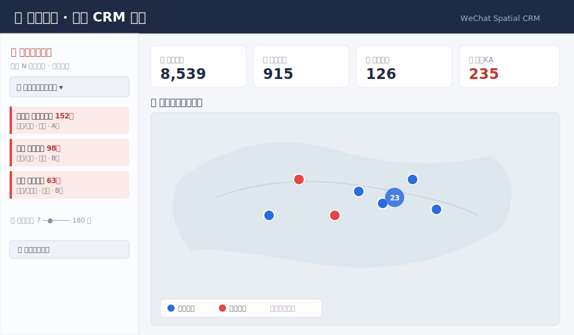

# 微信客情 · 空间 CRM ｜ WeChat Spatial CRM

> 用 RPA 读取 PC 微信(4.x)通讯录与会话，自动整理成客情数据，并在网页看板上做**空间可视化 + 轻量 CRM**：地图分布、按省出差拜访、流失预警、可编辑客户档案、自动定级。
>
> Read your PC WeChat (4.x) contacts via UI automation, turn them into structured CRM data, and visualize on a Streamlit + Folium dashboard: map distribution, province-based visit planning, churn alerts, editable customer records, auto-tiering.

---

## ✨ 功能 Features

- 🗺️ **空间地图**：合作伙伴按真实地区地理编码上图，标记聚合，支持上千点
- 🧭 **全局省份联动**：选一个省 → 地图 / 拜访清单 / 预警 / KPI 一起聚焦
- 🧳 **出差拜访清单**：按省列出可拜访客户（公司 / 公司类型 / 级别 / 状态 / 城市），可按类型筛、可导出 CSV
- 🚨 **流失预警**：可调阈值（7~180 天未联系），按省 / 公司类型筛选
- ✏️ **可编辑客户管理**：合作状态 / 公司 / 级别 / 行业 / 跟进人 / 备注，存独立文件，重采不丢
- ⭐ **自动定级**：中国央企→A级、金融机构 / 在合作→B级，其余 C级（关键词规则可改，人工可覆盖）
- 🏢 **自动识别**：从备注/标签推断公司名与 16 类公司类型
- 🔄 **网页一键刷新**：在看板上直接触发重新采集

## 🖼️ 预览 Preview



> 上图为界面示意（示例数据）。仓库**不含任何真实数据**；想放真实截图请用示例数据或先打码，再放到 `docs/` 并在此引用。

---

## 🌐 English (short)

**What it is:** a two-part tool — (1) a Windows RPA script (`rpa_extractor.py`, via `uiautomation`) that walks your PC WeChat 4.x contact list and session list into a JSON file, and (2) a Streamlit + Folium dashboard (`crm_dashboard.py`) that turns it into a lightweight spatial CRM: customer map, province-based business-trip visit lists, churn alerts with adjustable threshold, editable customer records, and rule-based auto-tiering.

**Try it (demo data, no WeChat needed):**
```bash
pip install -r requirements.txt
streamlit run crm_dashboard.py   # auto-loads wechat_data.sample.json
```
**Collect your own data (Windows + WeChat 4.x):** `python rpa_extractor.py`

⚠️ Personal/educational use only, on **your own** account & data. Automating WeChat may violate its ToS — use at your own risk. Never commit real data or scrape others' private info. See [Disclaimer](#-合规与免责声明-disclaimer).

---

## 🚀 快速开始 Quick Start

### 环境要求
- **Windows**（采集依赖 Windows UI 自动化；看板部分跨平台）
- **Python 3.9+**
- PC 端**微信 4.x** 并已登录（仅"采集"功能需要）

### 安装
```bash
git clone https://github.com/<your-name>/wechat-spatial-crm.git
cd wechat-spatial-crm
pip install -r requirements.txt
```

### 只看看板（用内置示例数据，开箱即用）
```bash
streamlit run crm_dashboard.py
```
浏览器打开 `http://localhost:8501`。没有真实数据时会**自动加载 `wechat_data.sample.json` 示例数据**，可直接体验全部功能。

### 采集自己的微信数据（Windows + 微信4.x）
```bash
python rpa_extractor.py
```
- 运行期间脚本会自动操控微信，**请勿移动鼠标键盘、保持微信前台、不要锁屏**
- 采集到底部自动停止；每 50 人增量落盘（断点保护）
- 输出 `wechat_data.json`，之后 `streamlit run crm_dashboard.py` 即用真实数据

### 导出 Excel/CSV
```bash
python export_data.py
```

---

## 🗂️ 项目结构

| 文件 | 作用 |
|---|---|
| `rpa_extractor.py` | 采集：uiautomation 驱动微信4.x，遍历通讯录提资料 + 解析会话摘要 |
| `crm_dashboard.py` | 看板：Streamlit + Folium |
| `run_dashboard.py` | 启动器（可选；自动开浏览器，适配某些受限 Python 环境） |
| `refresh_sessions.py` | 快速刷新最近会话（看板按钮调用） |
| `export_data.py` | 导出 Excel / CSV |
| `wechat_data.sample.json` | 示例数据（假数据，供 demo） |
| `requirements.txt` | 依赖 |

## 🔧 可定制点

- 央企关键词表：`crm_dashboard.py` 里 `CENTRAL_SOE_KEYWORDS`
- 公司类型分类规则：`_TYPE_RULES`
- 地名→经纬度：`PLACE_COORDS`
- 自动定级逻辑：`guess_tier()`
- 流失预警档位：`ALERT_OPTIONS`

## 🧩 技术说明：微信 4.x 适配

微信 4.x 是基于 Qt 的 `mmui::` 框架重构版，与 3.x 的 `WeChatMainWndForPC` 完全不同。本项目所用控件锚点（`mmui::MainWindow`、`contact_list`、`mmui::DetailView`、`chat_message_list` 等）均来自对微信 4.1 真实控件树的实地探测。不同小版本可能略有差异，定位失败时可用 `uiautomation` 自带的 `automation.py -t 0` 打印控件树自行微调。

> 经纬度 / `is_partner` 等可由内置规则生成，便于演示；接入真实大模型 / 地理编码 API 可进一步提升准确度。

---

## ⚠️ 合规与免责声明 Disclaimer

- 本项目仅供**个人学习、研究与对自己数据的整理**使用。
- 自动化操作微信可能不符合微信用户协议，请**自行评估风险**，**仅用于你自己的账号与数据**。
- 处理的是**真实个人信息**，请遵守所在地法律法规（如个人信息保护相关规定），**切勿采集、传播他人隐私数据**。
- 软件按 "AS IS" 提供，**不含任何担保**，使用产生的一切后果由使用者自负。
- 仓库**不包含任何真实数据**；请勿将你采集到的 `wechat_data.json` 等提交到公开仓库（已在 `.gitignore` 中排除）。

## 📄 License

[MIT](LICENSE)
